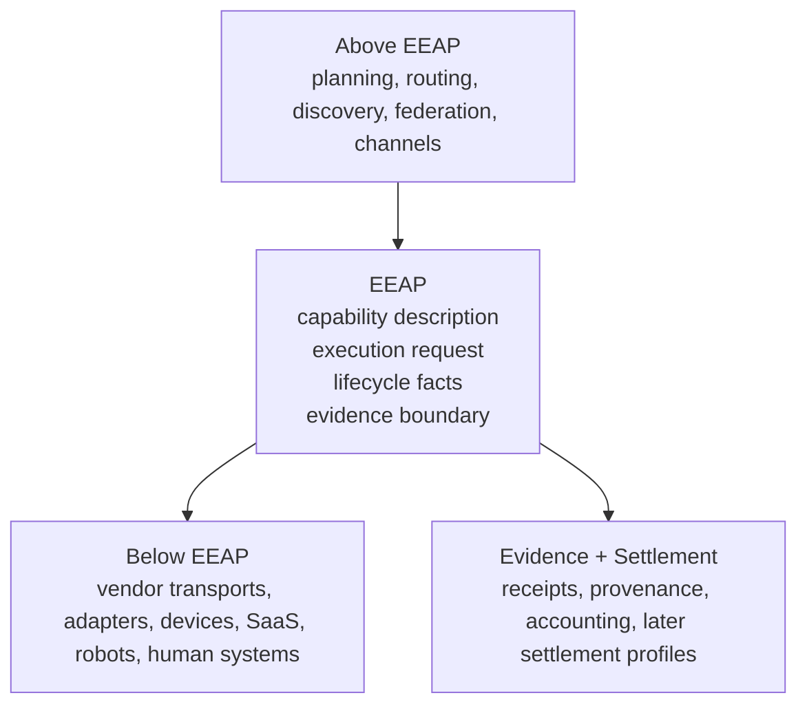
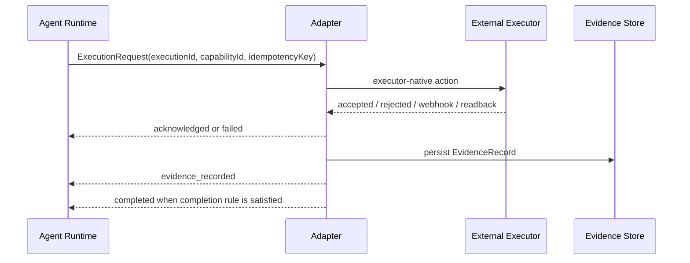
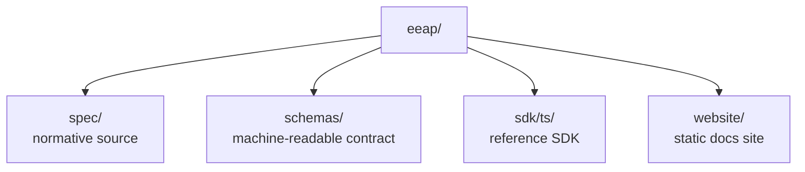

# EEAP Architecture

## Purpose

This document makes the system boundary explicit before readers dive into object fields and lifecycle rules.

EEAP is easiest to understand when treated as a narrow execution boundary rather than a general-purpose agent protocol.

## System Boundary

Interpretation:

- concerns above EEAP should stay outside the core
- concerns below EEAP should remain adapter-specific
- evidence and settlement connect to the same boundary without forcing every settlement detail into v0

## Execution Path

Key point:

- the adapter can speak any executor-native protocol it wants
- the runtime still receives a stable EEAP lifecycle vocabulary

## Repository Structure

This split keeps the protocol source of truth separate from website presentation and SDK ergonomics.
